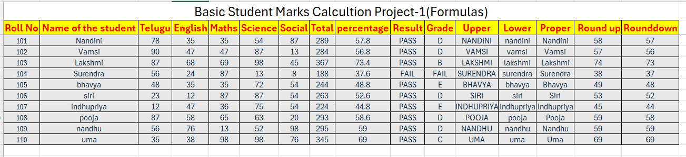
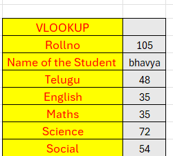
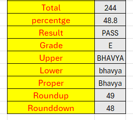
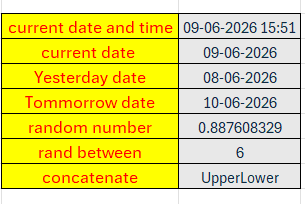

# 📊 Student Marks Calculation System Using Excel Formulas

## 📌 Project Overview

This project demonstrates the practical implementation of Microsoft Excel formulas and functions for student marks calculation, performance evaluation, ranking analysis, data retrieval, text manipulation, and date/time operations.

The project automates calculations and helps in efficient data analysis using Excel functions.

---

# 🎯 Objectives

- Calculate Total Marks and Percentage.
- Determine Pass or Fail Status.
- Assign Grades Automatically.
- Apply Text Functions.
- Apply Rounding Functions.
- Find Top and Least Performers.
- Retrieve Student Information using VLOOKUP.
- Use Date, Time, and Random Functions.

---

# 📋 Dataset Fields

The dataset contains the following fields:

- Roll Number
- Student Name
- Telugu
- English
- Mathematics
- Science
- Social
- Total
- Percentage
- Result
- Grade

---

# 📸 Student Marks Calculation



## Formulas Used

### Total Marks

```excel
=SUM(C2:G2)
```

### Percentage

```excel
=H2/500*100
```

### Result

```excel
=IF(I2>=35,"Pass","Fail")
```

### Grade

```excel
=IF(I2>=90,"A+",IF(I2>=75,"A",IF(I2>=60,"B",IF(I2>=50,"C","D"))))
```

### UPPER Function

```excel
=UPPER(B2)
```

### LOWER Function

```excel
=LOWER(B2)
```

### PROPER Function

```excel
=PROPER(B2)
```

### ROUNDUP Function

```excel
=ROUNDUP(I2,0)
```

### ROUNDDOWN Function

```excel
=ROUNDDOWN(I2,0)
```

---

# 📸 Topper and Least Analysis


## Top Performers

### First Topper

```excel
=LARGE(I2:I20,1)
```

### Second Topper

```excel
=LARGE(I2:I20,2)
```

### Third Topper

```excel
=LARGE(I2:I20,3)
```

## Least Performers

### First Least

```excel
=SMALL(I2:I20,1)
```

### Second Least

```excel
=SMALL(I2:I20,2)
```

### Third Least

```excel
=SMALL(I2:I20,3)
```

### Explanation

The LARGE function returns the highest values from a dataset, while the SMALL function returns the lowest values. These functions help identify the top-performing and least-performing students.

---

# 📸 Student Information Retrieval Using VLOOKUP




## VLOOKUP Formulas

### Student Name

```excel
=VLOOKUP(A25,$A$2:$N$20,2,FALSE)
```

### Telugu Marks

```excel
=VLOOKUP(A25,$A$2:$N$20,3,FALSE)
```

### English Marks

```excel
=VLOOKUP(A25,$A$2:$N$20,4,FALSE)
```

### Mathematics Marks

```excel
=VLOOKUP(A25,$A$2:$N$20,5,FALSE)
```

### Science Marks

```excel
=VLOOKUP(A25,$A$2:$N$20,6,FALSE)
```

### Social Marks

```excel
=VLOOKUP(A25,$A$2:$N$20,7,FALSE)
```

### Total

```excel
=VLOOKUP(A25,$A$2:$N$20,8,FALSE)
```

### Percentage

```excel
=VLOOKUP(A25,$A$2:$N$20,9,FALSE)
```

### Result

```excel
=VLOOKUP(A25,$A$2:$N$20,10,FALSE)
```

### Grade

```excel
=VLOOKUP(A25,$A$2:$N$20,11,FALSE)
```

### Explanation

The VLOOKUP function searches for a Roll Number and automatically retrieves the corresponding student details from the database.

---

# 📸 Date, Time and Miscellaneous Functions



## Current Date and Time

```excel
=NOW()
```

## Current Date

```excel
=TODAY()
```

## Yesterday Date

```excel
=TODAY()-1
```

## Tomorrow Date

```excel
=TODAY()+1
```

## Random Number

```excel
=RAND()
```

## Random Number Between Values

```excel
=RANDBETWEEN(1,100)
```

## CONCATENATE Function

```excel
=CONCATENATE(A2," ",B2)
```

### Explanation

These functions are used to generate dates, times, random values, and combine text from multiple cells.

---

# 🛠 Tools Used

- Microsoft Excel
- Excel Formulas and Functions
- GitHub
- GitHub Markdown

---

# ✨ Features Demonstrated

- SUM Function
- IF Function
- Percentage Calculation
- Grade Calculation
- UPPER Function
- LOWER Function
- PROPER Function
- ROUNDUP Function
- ROUNDDOWN Function
- LARGE Function
- SMALL Function
- VLOOKUP Function
- TODAY Function
- NOW Function
- RAND Function
- RANDBETWEEN Function
- CONCATENATE Function

---

# 📚 Learning Outcomes

Through this project, I gained practical experience in:

- Excel Formula Implementation
- Student Performance Analysis
- Data Retrieval Techniques
- Ranking Calculations
- Text Manipulation
- Date and Time Functions
- Professional Documentation using GitHub

---

# 🏁 Conclusion

This project demonstrates how Microsoft Excel can be used to automate student marks calculation, performance evaluation, ranking analysis, and data retrieval. It showcases the power of Excel formulas in simplifying data management and improving productivity.

---

# 👩‍💻 Author

**Nandini Moravaneni**

B.Tech Student | Aspiring AI Engineer | Excel & Data Analysis Enthusiast
